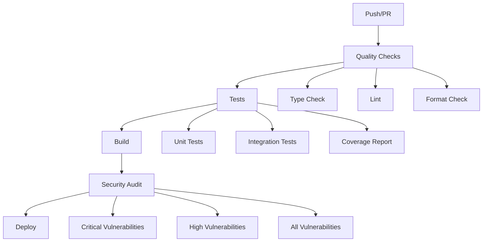

# GitHub Actions Workflows

## 🚀 CI/CD Pipeline (`ci-cd.yml`)

Este es el workflow principal y consolidado que reemplaza todos los workflows anteriores.

### 📋 **Características:**

- **Quality Checks**: Type checking, linting y format checking
- **Testing**: Unit tests, integration tests y coverage reports
- **Build**: Compilación de la aplicación
- **Security**: Auditoría de seguridad
- **Deploy**: Preparación para deployment

### 🔄 **Flujo de Ejecución:**



### 🎯 **Jobs:**

1. **Quality Checks** (Siempre ejecuta)
    - Type checking con TypeScript
    - Linting con ESLint
    - Format checking con Prettier

2. **Tests** (Depende de Quality Checks)
    - Unit tests con Vitest
    - Integration tests con Vitest
    - Coverage reports
    - Upload a Codecov
    - Artifacts de coverage

3. **Build** (Depende de Tests)
    - Compilación TypeScript
    - Artifacts de build

4. **Security** (Solo en main)
    - Auditoría de vulnerabilidades críticas
    - Auditoría de vulnerabilidades altas
    - Auditoría completa

5. **Deploy** (Solo en main, depende de Build y Security)
    - Descarga de artifacts
    - Placeholder para deployment

### 🔧 **Servicios:**

- **MongoDB 6.0**: Para tests de integración
- **Redis 7-alpine**: Para tests de integración

### 📊 **Variables de Entorno:**

```yaml
NODE_ENV: test
MONGODB_URI: mongodb://localhost:27017/vegan-city-guide-test
JWT_SECRET: test-jwt-secret-key-for-github-actions
REDIS_HOST: localhost
REDIS_PORT: 6379
```

### ⚡ **Optimizaciones:**

- **Concurrency**: Cancela ejecuciones previas en la misma rama
- **Caching**: Cache de npm para dependencias
- **Parallel Jobs**: Quality checks y tests se ejecutan en paralelo cuando es posible
- **Conditional Jobs**: Security y Deploy solo en main

### 🗑️ **Workflows Eliminados:**

- `build.yml` - Consolidado en ci-cd.yml
- `api-tests.yml` - Consolidado en ci-cd.yml
- `build-test.yml` - Obsoleto, eliminado

### 📈 **Métricas:**

- **Tiempo de ejecución**: ~5-8 minutos
- **Cobertura**: Automática con Codecov
- **Artifacts**: Retención de 30 días
- **Cache**: npm dependencies

### 🔍 **Debugging:**

Para debuggear el workflow:

1. Revisa los logs de cada job
2. Verifica las variables de entorno
3. Comprueba la conectividad de servicios (MongoDB, Redis)
4. Revisa los artifacts generados

### 🚀 **Próximos Pasos:**

1. Configurar deployment real (AWS, Vercel, etc.)
2. Agregar E2E tests con Playwright
3. Implementar notificaciones (Slack, Discord)
4. Agregar performance testing
